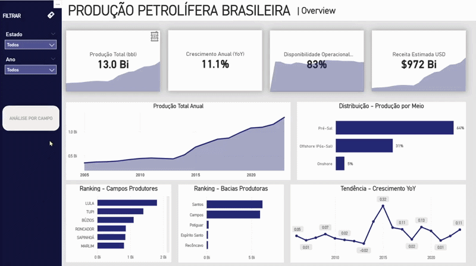
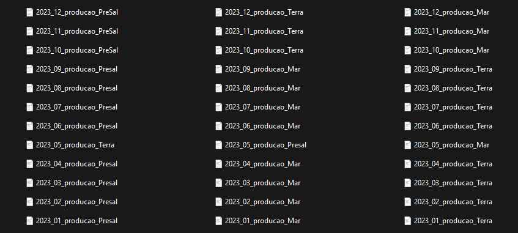
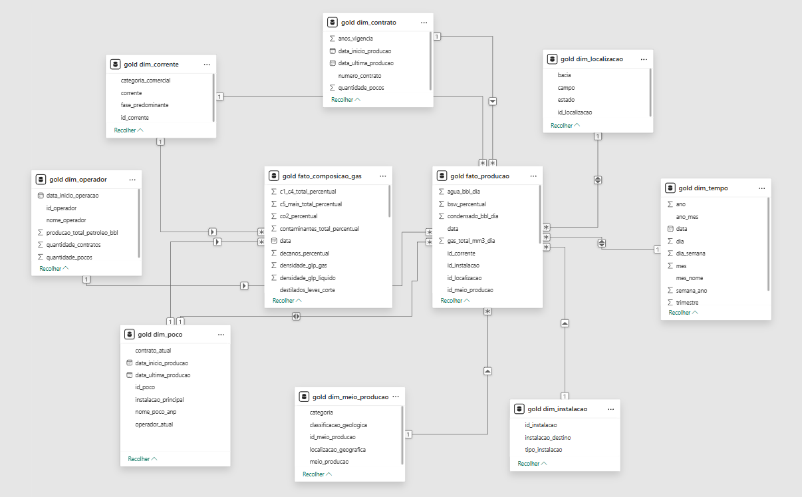
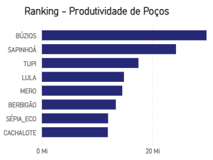

# 🛢️ Projeto de Engenharia de Dados e Análise da Produção de Petróleo no Brasil

**Fonte:** Dados Públicos da ANP  
**Período analisado:** 2005 - 2023

---

## 📌 Visão Geral

Este projeto tem como objetivo realizar uma análise **técnica, consistente e transparente** da produção de petróleo no Brasil, utilizando exclusivamente **dados públicos mensais disponibilizados pela ANP**, abrangendo o período de 2005 a 2023.

O foco não está apenas na visualização dos dados, mas em **todo o pipeline analítico**, desde a **engenharia de dados em PostgreSQL**, passando pela **modelagem dimensional**, até a construção de **métricas analíticas em Power BI (DAX)**, lidando com **problemas reais de dados industriais**.

---

## 📥 Origem e Consolidação dos Dados da ANP

Os dados utilizados neste projeto foram baixados diretamente do site da ANP, na seção de dados públicos de produção de petróleo e gás natural.

Durante a ingestão, foi identificado que os arquivos disponibilizados pela ANP **não seguem um único padrão ao longo do tempo**, o que exigiu um trabalho prévio de consolidação antes da carga no banco de dados.

---

## 📂 Estrutura Original dos Dados

- Os dados históricos são disponibilizados **separadamente por ano**
- Cada arquivo anual contém produção segmentada por **meio de produção**:
  - Terra
  - Mar
  - Pré-sal
- O **pré-sal passa a aparecer apenas a partir de aproximadamente 2014**, refletindo o início da sua relevância produtiva

---

## 📅 Particularidade dos Dados Recentes (2021-2023)

Para os anos mais recentes (**2021, 2022 e 2023**), a ANP disponibiliza os dados de forma **ainda mais fragmentada**, com arquivos separados por:

- Meio de produção (**Terra / Mar / Pré-sal**)
- Mês de referência (**Mês 1, Mês 2, …, Mês 12**)

---

## 🔧 Processo de Consolidação

Para lidar com essa fragmentação, foi necessário um processo intermediário antes da ingestão no banco de dados:

1. Consolidação manual inicial em **Excel**
2. Uso do **Power Query** para:
   - Unir arquivos de diferentes anos
   - Padronizar colunas
   - Garantir consistência entre períodos históricos e recentes
3. Geração de um **dataset único e homogêneo**
4. Carga final desse dataset consolidado na **camada Bronze do PostgreSQL**

Somente após essa etapa os dados seguiram para:

- Tratamento na **Silver Layer**
- Modelagem analítica na **Gold Layer**

---

📌 Esse passo foi fundamental para garantir **consistência temporal**, permitir análises históricas contínuas (**2005-2023**) e evitar distorções causadas pela fragmentação dos arquivos originais da ANP.

## 🧱 Arquitetura de Dados

### 🔹 Stack Utilizada

- **Banco de dados:** PostgreSQL
- **Camada analítica:** Power BI
- **Modelagem:** Dimensional (Star Schema)
- **Linguagens:** SQL e DAX

---

### 🔹 Arquitetura em Camadas (Medallion Architecture)

O pipeline foi estruturado seguindo a **arquitetura Medallion**, garantindo escalabilidade, rastreabilidade e clareza analítica.

#### 🟤 Bronze Layer - Dados Brutos

- Ingestão direta dos dados públicos da ANP
- Sem transformações estruturais

#### ⚪ Silver Layer - Dados Tratados

- Padronização de campos textuais
- Conversão de tipos
- Normalização de nomenclaturas
- Tratamento de valores inconsistentes

**Tabela central:**

- `silver.producao_pocos`

Cada linha representa:

> **1 poço × 1 mês**

---

#### 🥇 Gold Layer - Camada Analítica

Camada projetada para consumo analítico, seguindo **Star Schema**, com separação clara entre fato e dimensões.

### 📌 Tabela Fato

**`gold.fato_producao`**

Contém métricas operacionais e produtivas:

- Produção média diária de petróleo (bbl/dia)
- Produção de gás natural
- Produção de água
- Produção de condensado
- Tempo de produção mensal (horas)

**Métricas derivadas:**

- Disponibilidade operacional (%)
- BSW (%)
- RGO (Relação Gás-Óleo)

---

### 📌 Tabelas Dimensão

- `gold.dim_poco`
- `gold.dim_campo`
- `gold.dim_operador`
- `gold.dim_localizacao`
- `gold.dim_instalacao`
- `gold.dim_corrente`
- `gold.dim_tempo`

🔑 **Chaves substitutas (UUID)** foram geradas via **hash (MD5)** para:

- Garantir unicidade
- Evitar dependência de chaves textuais inconsistentes
- Resolver duplicidades presentes no dataset da ANP

---

## ⚠️ Desafios Reais dos Dados da ANP

Durante o desenvolvimento, foram identificados problemas estruturais relevantes:

### 1️⃣ Produção diária com tempo de produção zero

Muitas linhas apresentam:

- `petroleo_bbl_dia > 0`
- `tempo_producao_horas_mes = 0`

Isso inviabiliza o cálculo direto do volume mensal sem inferência e gera diferenças inevitáveis entre análises independentes e números oficiais consolidados.

---

### 2️⃣ Ausência de metodologia pública detalhada

Os números oficiais consolidados da ANP **não explicitam completamente**:

- Regras de consolidação
- Tratamento de poços intermitentes
- Inferências operacionais internas

---

## 🧠 Lógica de Cálculo do Volume Produzido

### Princípio Adotado

O projeto prioriza **coerência física e operacional**, evitando **superestimação da produção**.

---

### 🔹 Regra Geral

Cada linha representa:

**Produção média diária declarada × tempo efetivo de produção**

---

### 🔹 Caso 1 - Tempo Informado (> 0)

Volume Mensal = petroleo_bbl_dia × (tempo_producao_horas_mes ÷ 24)

---

### 🔹 Caso 2 - Tempo = 0 ou Nulo (Inferência Técnica)

Quando o tempo não está informado, foi aplicada uma **inferência baseada em práticas de mercado**, sem uso de médias globais ou produção agregada.

**Fatores de disponibilidade inferidos:**

| Meio de Produção | Fator | Horas/mês |
| ---------------- | ----: | --------: |
| Terra            |   55% |    ~396 h |
| Mar              |   72% |    ~518 h |
| Pré-sal          |   82% |    ~590 h |

📌 Essa inferência é **explicitamente documentada** e aplicada **somente quando necessário**.

---

## 📊 Análises Desenvolvidas

### Principais análises e indicadores:

- Produção total
- Produção anual
- Crescimento ano contra ano (YoY)
- Disponibilidade operacional
- Receita estimada
- Ranking de campos produtores
- Ranking de bacias produtoras
- Distribuição da produção por meio (Terra × Mar × Pré-sal)
- Evolução histórica da produção (2005-2023)
- Consistência operacional por tipo de ativo
- Total de poços por campo
- Pico de produção
- Declínio de campos
- Produção por instalação
- Produção por poço

---

### 🔍 Exemplo Relevante - Ano de 2023

Campos como **Tupi** aparecem à frente de **Búzios** em volume anual, o que é **tecnicamente coerente**, pois:

- Tupi possui **maior número de poços produtores ativos**
- Búzios apresenta **maior produtividade por poço**, porém com menor histórico agregado no período

---

## 🔎 Transparência Metodológica

Os resultados obtidos **podem diferir dos números oficiais consolidados da ANP**.  
Isso ocorre porque:

- A ANP utiliza **metodologias internas não totalmente publicadas**
- Os dados abertos possuem **lacunas operacionais**
- Inferências são inevitáveis em análises independentes

Todas as decisões técnicas, inferências e limitações estão **documentadas neste projeto**.

---

## 📣 Observação Final

Este projeto reflete um cenário real de **engenharia de dados industrial**, onde dados imperfeitos exigem decisões técnicas bem fundamentadas, documentadas e auditáveis.

---
